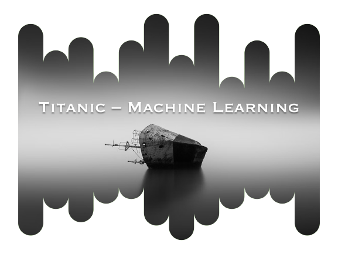

[![Contributors][contributors-shield]][contributors-url]
[![Forks][forks-shield]][forks-url]
[![Stargazers][stars-shield]][stars-url]
[![Issues][issues-shield]][issues-url]
[![LinkedIn][linkedin-shield]][linkedin-url]
<!-- [![MIT License][license-shield]][license-url] -->

<!-- PROJECT LOGO -->
 

  

<h1 align="center">Titanic - Machine Learning</h1>

  

    I trained in machine learning using the Titanic disaster data. The goal was to predict the survival or non-survival of passengers based on variables such as age, fare, gender, etc. to understand the factors that influence survival in emergency situations.
     
    <a href="https://github.com/CoCasali/titanic_ml"><strong>Explore the docs »</strong></a>
     

  

<!-- TABLE OF CONTENTS -->

  
Table of Contents

  <ol>
    <li>
      <a href="#about-the-project">About The Project</a>
      <ul>
        <li><a href="#built-with">Built With</a></li>
      </ul>
    </li>
    <li><a href="#usage">Usage</a></li>
    <li><a href="#contact">Contact</a></li>
  </ol>

<!-- ABOUT THE PROJECT -->
## About The Project

Start Date : 01-07-2022

**Contextual reminder**\
I trained in machine learning using the Titanic disaster data. The goal was to predict the survival or non-survival of passengers based on variables such as age, fare, gender, etc. to understand the factors that influence survival in emergency situations.

**Mission objective**
- Acquire the data of the Titanic : (https://www.kaggle.com/competitions/titanic/data)
- Clean the data by removing missing values and converting the data into appropriate format.
- Analyze the data to understand its structure and determine the variables that can influence the survival of passengers.
- Transform the data to prepare inputs for the model.
- Select the most appropriate algorithms for training and validation.
- Prediction of survival or non-survival of passengers.
- Evaluating the quality of the model using metrics such as accuracy, f1-score, etc.

**What can be improved?**
- Optimizing the performance of the model using machine learning techniques such as cross-validation and hyperparameter tuning.
- Interpretation of the results to understand the strengths and limitations of the model.

(<a href="#readme-top">back to top</a>)

### Built With

* [![Python][Python.js]][Python-url]
* [![Jupyter][Jupyter.icon]][Jupyter-url]

(<a href="#readme-top">back to top</a>)

<!-- USAGE EXAMPLES -->
## Usage

(<a href="#readme-top">back to top</a>)

<!-- CONTACT -->
## Contact

Corentin Casali - [@corentincasali](https://twitter.com/corentincasali)

Project Link: [https://github.com/CoCasali/titanic_ml](https://github.com/CoCasali/titanic_ml)

(<a href="#readme-top">back to top</a>)

<!-- MARKDOWN LINKS & IMAGES -->
<!-- https://www.markdownguide.org/basic-syntax/#reference-style-links -->
[contributors-shield]: https://img.shields.io/github/contributors/CoCasali/market-study-chicken.svg?style=for-the-badge
[contributors-url]: https://github.com/CoCasali/market-study-chicken/graphs/contributors
[forks-shield]: https://img.shields.io/github/forks/CoCasali/market-study-chicken.svg?style=for-the-badge
[forks-url]: https://github.com/CoCasali/market-study-chicken/network/members
[stars-shield]: https://img.shields.io/github/stars/CoCasali/market-study-chicken.svg?style=for-the-badge
[stars-url]: https://github.com/CoCasali/market-study-chicken/stargazers
[issues-shield]: https://img.shields.io/github/issues/CoCasali/market-study-chicken.svg?style=for-the-badge
[issues-url]: https://github.com/CoCasali/market-study-chicken/issues
[license-shield]: https://img.shields.io/github/license/CoCasali/market-study-chicken.svg?style=for-the-badge
[license-url]: https://github.com/CoCasali/market-study-chicken/blob/master/LICENSE.txt
[linkedin-shield]: https://img.shields.io/badge/-LinkedIn-black.svg?style=for-the-badge&logo=linkedin&colorB=555
[linkedin-url]: https://linkedin.com/in/corentincasali
[Python.js]: https://img.shields.io/badge/Made%20with-Python-yellow?style=for-the-badge&logo=Python&logoColor=yellow
[Python-url]: https://www.python.org/
[Jupyter.icon]:https://img.shields.io/badge/Made%20with-Jupyter-orange?style=for-the-badge&logo=Jupyter
[Jupyter-url]:https://jupyter.org/try
[R.icon]:https://img.shields.io/badge/MADE%20WITH-R-blue?style=for-the-badge&logo=R
[R-url]:https://www.r-project.org/

